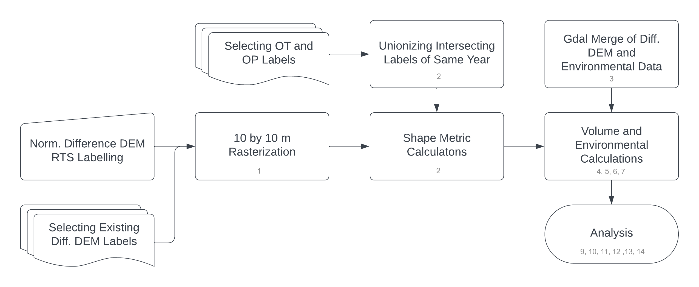

# Comparative Analysis of Multimodal Remote Sensing Techniques for Retrogressive Thaw Slump Monitoring

This repository contains Jupyter Notebooks used to process and analyze data from optical and Digital Elevation Model (DEM) remote sensing techniques for monitoring retrogressive thaw slumps. The code prepares the data so that the GeoJSON files from different monitoring methods can be compared more easily by calculating shape-specific metrics and appending them to the shapes found in the GeoJSON files.

## Overview

The following workflow chart illustrates the steps involved in the data processing and the specific Jupyter Notebooks used at each step. Each notebook includes a short description of its purpose and functionality.

## Repository Structure

- `notebooks/`: Contains the Jupyter Notebooks for data preparation and analysis.
- `data/`: Includes the input data files (e.g., optical images, DEMs).
- `output/`: Stores the processed GeoJSON files and other output data.
- `images/`: Contains images used in the documentation (e.g., workflow charts).

## Notebooks

1. [1_Rasterize_and_Polygonize_DEM_labels.ipynb](1_Rasterize_and_Polygonize_DEM_labels.ipynb)
2. [2_Get_Simple_Metrics.ipynb](2_Get_Simple_Metrics.ipynb)
3. [3_MosaicRasters_DEMs_slopes_aspects.ipynb](3_MosaicRasters_DEMs_slopes_aspects.ipynb)
4. [4_Get_Volume_DEM.ipynb](4_Get_Volume_DEM.ipynb)
5. [5_Get_Volume_OT_OP_buffer.ipynb](5_Get_Volume_OT_OP_buffer.ipynb)
6. [6_Get_slope_aspect.ipynb](6_Get_slope_aspect.ipynb)
7. [7_Get_environmental_data.ipynb](7_Get_environmental_data.ipynb)
8. [8_Analysis_Preparation.ipynb](8_Analysis_Preparation.ipynb)
9. [9_Analysis_IoU.ipynb](9_Analysis_IoU.ipynb)
10. [10_Analysis_F1_Score.ipynb](10_Analysis_F1_Score.ipynb)
11. [11_Analysis_Area_Circularity_Solidity.ipynb](11_Analysis_Area_Circularity_Solidity.ipynb)
12. [12_Analysis_Volume.ipynb](12_Analysis_Volume.ipynb)
13. [13_Analysis_EnvInfluence_Area.ipynb](13_Analysis_EnvInfluence_Area.ipynb)
14. [14_Analysis_EnvInfluence_Shape.ipynb](14_Analysis_EnvInfluence_Shape.ipynb)

## Getting Started

### Prerequisites

- Python 3.12.2
- Jupyter Notebook

## Required Python Packages

- numpy
- pandas
- geopandas
- shapely
- rasterio
- matplotlib
- seaborn
- basemap
- scipy
- gdal

